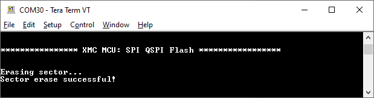
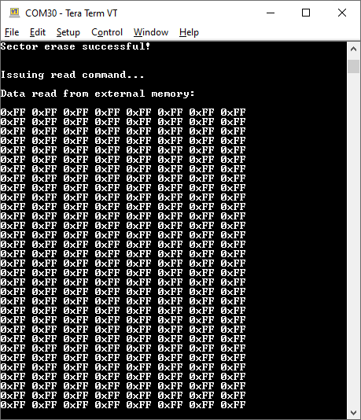
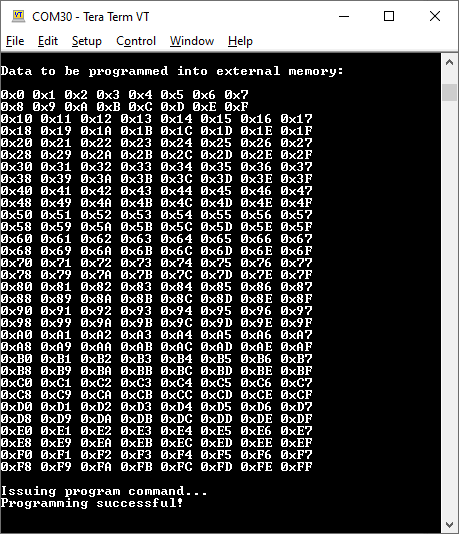
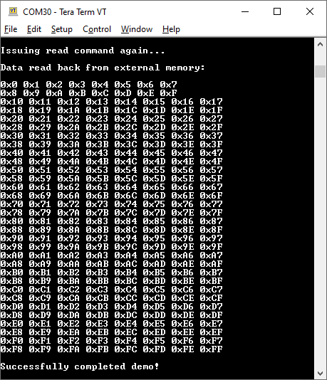
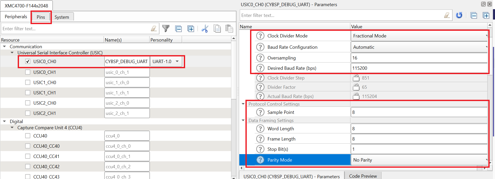
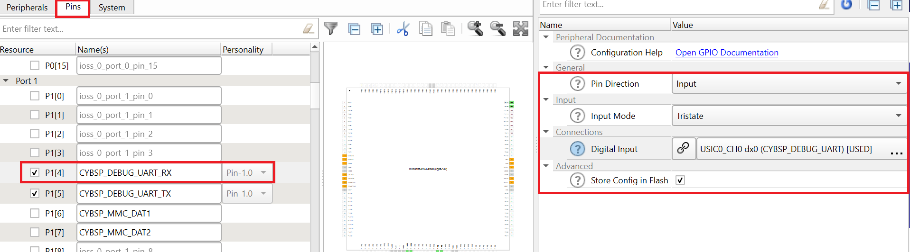
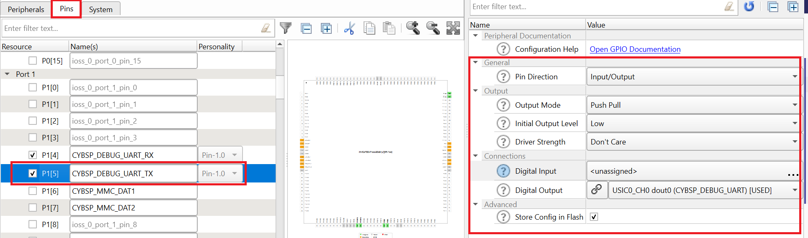

# XMC&trade; MCU: SPI QSPI flash

This example demonstrates how the communication between the SPI master and the onboard QSPI flash chip takes place using the SPI interface.

- XMC4400 Platform2Go kit (master) uses the onboard QSPI flash chip [SST26VF032BT-104I/SM](https://www.infinity-electron.com/datasheet/24-SST26VF064B-104I-S70S.pdf) (slave)
- XMC4500 relax kit V1 (master) uses the onboard QSPI flash chip [S25FL032P](https://www.infineon.com/dgdl/Infineon-S25FL032P_32-Mbit_3.0_V_Flash_Memory-DataSheet-v13_00-EN.pdf?fileId=8ac78c8c7d0d8da4017d0ed4e2dd5369&utm_source=cypress&utm_medium=referral&utm_campaign=202110_globe_en_all_integration-files) (slave)
- XMC4700 relax kit V1 (master) uses the onboard QSPI flash chip [N25Q03](https://in.micron.com/products/nor-flash/serial-nor-flash/part-catalog/n25q032a13ese40f) (slave)
- XMC4800 relax EtherCAT kit V1 (master) uses the onboard QSPI flash chip [N25Q03](https://in.micron.com/products/nor-flash/serial-nor-flash/part-catalog/n25q032a13ese40f) (slave)


## Requirements

- [ModusToolbox&trade; software](https://www.infineon.com/cms/en/design-support/tools/sdk/modustoolbox-software/) v3.0 or later (tested with v3.3)
- [SEGGER J-Link software](https://www.segger.com/downloads/jlink/#J-LinkSoftwareAndDocumentationPack)
- Programming language: C
- Associated parts: [XMC™ 4000 series MCU](https://www.infineon.com/cms/en/product/microcontroller/32-bit-industrial-microcontroller-based-on-arm-cortex-m/32-bit-xmc4000-industrial-microcontroller-arm-cortex-m4/) parts

## Supported toolchains (make variable 'TOOLCHAIN')

- GNU Arm® Embedded Compiler v10.3.1 (`GCC_ARM`) - Default value of `TOOLCHAIN`

## Supported kits (make variable 'TARGET')

- [XMC4400 Platform2Go kit](https://www.infineon.com/cms/en/product/evaluation-boards/kit_xmc_plt2go_xmc4400/) (`KIT_XMC_PLT2GO_XMC4400`)
- [XMC4500 relax kit](https://www.infineon.com/cms/en/product/evaluation-boards/kit_xmc45_relax_v1/) (`KIT_XMC45_RELAX_V1`)
- [XMC4700 relax kit](https://www.infineon.com/cms/en/product/evaluation-boards/kit_xmc47_relax_v1/) (`KIT_XMC47_RELAX_V1`) - Default value of `TARGET`
- [XMC4800 relax EtherCAT kit](https://www.infineon.com/cms/en/product/evaluation-boards/kit_xmc48_relax_ecat_v1/) (`KIT_XMC48_RELAX_ECAT_V1`)

## Hardware setup

This example uses the board's default configuration. See the kit user guide to ensure that the board is configured correctly.

## Software setup

Install a terminal emulator if you don't have one. Instructions in this document use [Tera Term](https://ttssh2.osdn.jp/index.html.en).

## Using the code example

Create the project and open it using one of the following:

<details open><summary><b>In Eclipse IDE for ModusToolbox&trade; software</b></summary>

1. Click the **New Application** link in the **Quick Panel** (or, use **File** > **New** > **ModusToolbox Application**). This launches the [Project Creator](https://www.infineon.com/ModusToolboxProjectCreator) tool.

2. Pick a kit supported by the code example from the list shown in the **Project Creator - Choose Board Support Package (BSP)** dialog.

   When you select a supported kit, the example is reconfigured automatically to work with the kit. To work with a different supported kit later, use the [Library Manager](https://www.infineon.com/ModusToolboxLibraryManager) to choose the BSP for the supported kit. You can use the Library Manager to select or update the BSP and firmware libraries used in this application. To access the Library Manager, click the link from the **Quick Panel**.

   You can also just start the application creation process again and select a different kit.

   If you want to use the application for a kit not listed here, you may need to update the source files. If the kit does not have the required resources, the application may not work.

3. In the **Project Creator - Select Application** dialog, choose the example by enabling the checkbox.

4. (Optional) Change the suggested **New Application Name**.

5. The **Application(s) Root Path** defaults to the Eclipse workspace which is usually the desired location for the application. If you want to store the application in a different location, you can change the *Application(s) Root Path* value. Applications that share libraries should be in the same root path.

6. Click **Create** to complete the application creation process.

For more details, see the [Eclipse IDE for ModusToolbox&trade; software user guide](https://www.infineon.com/MTBEclipseIDEUserGuide) (locally available at *{ModusToolbox&trade; software install directory}/ide_{version}/docs/mtb_ide_user_guide.pdf*).

</details>

<details open><summary><b>In command-line interface (CLI)</b></summary>

ModusToolbox&trade; software provides the Project Creator as both a GUI tool and the command line tool, "project-creator-cli". The CLI tool can be used to create applications from a CLI terminal or from within batch files or shell scripts. This tool is available in the *{ModusToolbox&trade; software install directory}/tools_{version}/project-creator/* directory.

Use a CLI terminal to invoke the "project-creator-cli" tool. On Windows, use the command line "modus-shell" program provided in the ModusToolbox&trade; software installation instead of a standard Windows command-line application. This shell provides access to all ModusToolbox&trade; software tools. You can access it by typing `modus-shell` in the search box in the Windows menu. In Linux and macOS, you can use any terminal application.

This tool has the following arguments:

Argument | Description | Required/optional
---------|-------------|-----------
`--board-id` | Defined in the `<id>` field of the [BSP](https://github.com/Infineon?q=bsp-manifest&type=&language=&sort=) manifest | Required
`--app-id`   | Defined in the `<id>` field of the [CE](https://github.com/Infineon?q=ce-manifest&type=&language=&sort=) manifest | Required
`--target-dir`| Specify the directory in which the application is to be created if you prefer not to use the default current working directory | Optional
`--user-app-name`| Specify the name of the application if you prefer to have a name other than the example's default name | Optional

<br>

The following example will clone the [SPI QSPI Flash](https://github.com/Infineon/mtb-example-xmc-spi-qspi-flash) application with the desired name "SPI_QSPI_FLASH" configured for the *KIT_XMC47_RELAX_V1* BSP into the specified working directory, *C:/mtb_projects*:

   ```
   project-creator-cli --board-id KIT_XMC47_RELAX_V1 --app-id mtb-example-xmc-spi-qspi-flash --user-app-name SPI_QSPI_FLASH --target-dir "C:/mtb_projects"
   ```

**Note:** The project-creator-cli tool uses the `git clone` and `make getlibs` commands to fetch the repository and import the required libraries. For details, see the "Project creator tools" section of the [ModusToolbox&trade; software user guide](https://www.infineon.com/ModusToolboxUserGuide) (locally available at *{ModusToolbox&trade; software install directory}/docs_{version}/mtb_user_guide.pdf*).

</details>

<details open><summary><b>In third-party IDEs</b></summary>

**Note:** Only VS Code is supported.

1. Follow the instructions from the **In command-line interface (CLI)** section to create the application, and import the libraries using the `make getlibs` command.

2. Export the application to a supported IDE using the `make <ide>` command.

   For a list of supported IDEs and more details, see the "Exporting to IDEs" section of the [ModusToolbox&trade; software user guide](https://www.infineon.com/ModusToolboxUserGuide) (locally available at *{ModusToolbox&trade; software install directory}/docs_{version}/mtb_user_guide.pdf*).

3. Follow the instructions displayed in the terminal to create or import the application as an IDE project.

</details>

## Operation

1. Connect the board to your PC using a micro-USB cable through the debug USB connector.

   **Note:** XMC4500 relax kit does not enumerate as a virtual COM port. You need to make the connections externally using a USB-to-serial converter with the following connections:

   Pin function  | Input/output | XMC&trade; MCU pin
   ------- | --------- | -----------------
   Transmit pin for UART communication (PC_RX) | Output | P0.0 (U1C1.DX0D)
   Receive pin for UART communication (PC_TX) | Input |  P0.1 (U1C1.DOUT0)

2. Open a terminal program and select the J-Link CDC UART COM port. Configure the terminal with a baud rate of 115200, data bits of 8, stop bits of 1, and with parity and flow control set to none.

3. Program the board using Eclipse IDE for ModusToolbox&trade; software:

   1. Select the application project in the Project Explorer.

   2. In the **Quick Panel**, scroll down, and click **\<Application Name> Program (JLink)**.

      After programming, the onboard LED glows.

4. Open your serial terminal software. The sequence of operations being performed will be displayed.

   **Note:** If an error occurs, appropriate error messages are printed, and the LED will start blinking.

      **Figure 1. Sector erase**

      

      <br>

      **Figure 2. Memory read**

      

      <br>

      **Figure 3. Program memory**

      

5. Once the program operation completes, the data is automatically read back from the external memory for validation, and displayed onto the terminal if they match.

      **Figure 4. Data validation**

      

      <br>


## Debugging

You can debug the example to step through the code. In the IDE, use the **\<Application Name> Debug (JLink)** configuration in the **Quick Panel**. For more details, see the "Program and debug" section in the [Eclipse IDE for ModusToolbox&trade; software user guide](https://www.infineon.com/MTBEclipseIDEUserGuide).

## Design and implementation

The universal serial interface channel module (USIC) is a flexible interface module covering several serial communication protocols. It supports Standard, Dual, and Quad SPI interfaces under the SPI protocol.

The XMC4400 Platform2Go kit provides a 32-Mbit serial flash memory from Micron ([SST26VF032BT-104I/SM](https://www.infinity-electron.com/datasheet/24-SST26VF064B-104I-S70S.pdf)) interfaced through the SPI interface.

The XMC4500 relax kit provides a 32-Mbit serial flash memory from Micron ([S25FL032P](https://www.infineon.com/dgdl/Infineon-S25FL032P_32-Mbit_3.0_V_Flash_Memory-DataSheet-v13_00-EN.pdf?fileId=8ac78c8c7d0d8da4017d0ed4e2dd5369&utm_source=cypress&utm_medium=referral&utm_campaign=202110_globe_en_all_integration-files)) interfaced through the SPI interface.

The XMC4700 relax kit provides a 32-Mbit serial flash memory from Micron ([N25Q032A](https://in.micron.com/products/nor-flash/serial-nor-flash/part-catalog/n25q032a13ese40f)) interfaced through the SPI interface.

The XMC4800 relax EtherCAT kit provides a 32-Mbit serial flash memory from Micron ([N25Q032A](https://in.micron.com/products/nor-flash/serial-nor-flash/part-catalog/n25q032a13ese40f)) interfaced through the SPI interface.


This code example uses the Quad SPI interface to communicate with the memory chip. It configures the device as the SPI master with the following pin mapping and functionality:

- For XMC4400 Platform2Go kit:

   XMC&trade; MCU pin | Function in QSPI mode
   ------- | ----------------------
   P0.8    | Clock, U0C0.SCLKOUT
   P1.11   | Chip Select, U0C0.SELO0
   P1.5    | Data Line 0 I/O, U0C0.DOUT0
   P1.4    | Data Line 1, U0C0.DOUT1
   P1.3    | Data Line 2, U0C0.DOUT2
   P1.2    | Data Line 3, U0C0.DOUT3

- For XMC4500 relax kit:

   XMC&trade; MCU pin | Function in QSPI mode
   ------- | ----------------------
   P1.10   | Clock, U0C0.SCLKOUT
   P1.8    | Chip Select, U0C0.SELO1
   P1.5    | Data Line 0 I/O, U0C0.DOUT0
   P1.4    | Data Line 1, U0C0.DOUT1
   P1.3    | Data Line 2, U0C0.DOUT2
   P1.2    | Data Line 3, U0C0.DOUT3

- For XMC4700 relax kit:

   XMC&trade; MCU pin | Function in QSPI mode
   ------- | ----------------------
   P4.2    | Clock, U2C1.SCLKOUT
   P4.3    | Chip Select, U2C1.SELO2
   P4.7    | Data Line 0 I/O, U2C1.DOUT0
   P4.6    | Data Line 1, U2C1.DOUT1
   P4.5    | Data Line 2, U2C1.DOUT2
   P4.4    | Data Line 3, U2C1.DOUT3

- For XMC4800 relax EtherCAT kit:

   XMC&trade; MCU pin | Function in QSPI mode
   ------- | ----------------------
   P4.2    | Clock, U2C1.SCLKOUT
   P4.3    | Chip Select, U2C1.SELO2
   P4.7    | Data Line 0 I/O, U2C1.DOUT0
   P4.6    | Data Line 1, U2C1.DOUT1
   P4.5    | Data Line 2, U2C1.DOUT2
   P4.4    | Data Line 3, U2C1.DOUT3

<br>

The code example uses a number of files to help configure various parameters to interface the external memory chip:

File | Description
------- | ---------
*memory_driver.h* | Provides declarations for interfacing with the N25Q03/S25FL032P/SST26VF032BT-104I/SM memory chip
*memory_driver.c* | Provides definitions for interfacing with the N25Q03/S25FL032P/SST26VF032BT-104I/SM memory chip
*spi_master_conf.h* | Provides macros to configure the interrupt handlers
*spi_master_conf.c* | Provides structures to configure the pins, channel, and other parameters of the SPI master
*spi_master.h* | Provides declarations for the high-level SPI wrapper
*spi_master.c* | Provides definitions for the high-level SPI wrapper

<br>

The N25Q03/S25FL032P memory chip supports several commands. Only some of them have been used in the code example for demonstration purposes. You must implement the other commands if required, by following the datasheet.

When interfacing with different memory chips, the respective driver files similar to *memory_driver.c/.h* must be created. To change the pin mappings, the *spi_master_conf.c/.h* files must be modified with the correct pins and alternate functionality based on the device datasheet.

## Resources and settings

The code example uses a custom *design.modus* file because it uses the **universal serial interface channel (USIC)** block to implement the shell application. The following settings were modified in the default *design.modus* file.

**Figure 5. USIC (UART) settings**



<br>

**Figure 6. UART Rx settings**



<br>

**Figure 7. UART Tx settings**



<br>

## Related resources
Resources | Links
----------|--------
Code examples  | [Using ModusToolbox&trade; software](https://github.com/Infineon/Code-Examples-for-ModusToolbox-Software) on GitHub
Device documentation  | [XMC4000 family datasheets](https://www.infineon.com/cms/en/product/microcontroller/32-bit-industrial-microcontroller-based-on-arm-cortex-m/32-bit-xmc4000-industrial-microcontroller-arm-cortex-m4/#document-group-myInfineon-49) <br> [XMC4000 family technical reference manuals](https://www.infineon.com/cms/en/product/microcontroller/32-bit-industrial-microcontroller-based-on-arm-cortex-m/32-bit-xmc4000-industrial-microcontroller-arm-cortex-m4/#document-group-myInfineon-44)
Kit guides  | [XMC4500 relax kit](https://www.infineon.com/dgdl/Board_Users_Manual_XMC4500_Relax_Kit-V1_R1.2_released.pdf?fileId=db3a30433acf32c9013adf6b97b112f9) <br> [XMC4700/XMC4800 relax kit series-V1](https://www.infineon.com/dgdl/Infineon-Board_User_Manual_XMC4700_XMC4800_Relax_Kit_Series-UM-v01_02-EN.pdf?fileId=5546d46250cc1fdf01513f8e052d07fc)
Development kits | [XMC&trade; MCU eval boards](https://www.infineon.com/cms/en/product/microcontroller/32-bit-industrial-microcontroller-based-on-arm-cortex-m/#boards)
Libraries on GitHub | [mtb-xmclib-cat3](https://github.com/Infineon/mtb-xmclib-cat3) – XMC&trade; MCU peripheral library (XMCLib) and docs
Tools | [Eclipse IDE for ModusToolbox&trade; software](https://www.infineon.com/cms/en/design-support/tools/sdk/modustoolbox-software/) – ModusToolbox&trade; software is a collection of easy-to-use software and tools enabling rapid development with Infineon MCUs, covering applications from embedded sense and control to wireless and cloud-connected systems using AIROC&trade; Wi-Fi and Bluetooth® connectivity devices.


## Other resources

Infineon provides a wealth of data at www.infineon.com to help you select the right device, and quickly and effectively integrate it into your design.

For XMC&trade; MCU devices, see [32-bit XMC™ industrial microcontroller based on Arm® Cortex®-M](https://www.infineon.com/cms/en/product/microcontroller/32-bit-industrial-microcontroller-based-on-arm-cortex-m/).

## Document history

Document title: *CE232911* - *XMC&trade; MCU: SPI QSPI flash*

 Version | Description of change 
 ------- | --------------------- 
 1.0.0   | New code example
 1.1.0   | Added support for new kits
 2.0.0   | Added support for SPI personality; Updated to support ModusToolbox software v3.0; CE will not be backwards compatible with previous versions of ModusToolbox™ software |
| 2.0.1   | Updated README        |
| 2.0.2   | Fixed build warnings  |
------

All other trademarks or registered trademarks referenced herein are the property of their respective owners.

© 2022-2024 Infineon Technologies AG

All Rights Reserved.

### Legal disclaimer

The information given in this document shall in no event be regarded as a guarantee of conditions or characteristics. With respect to any examples or hints given herein, any typical values stated herein and/or any information regarding the application of the device, Infineon Technologies hereby disclaims any and all warranties and liabilities of any kind, including without limitation, warranties of non-infringement of intellectual property rights of any third party.

### Information

For further information on technology, delivery terms and conditions and prices, please contact the nearest Infineon Technologies Office (www.infineon.com).

### Warnings

Due to technical requirements, components may contain dangerous substances. For information on the types in question, please contact the nearest Infineon Technologies Office.

Infineon Technologies components may be used in life-support devices or systems only with the express written approval of Infineon Technologies, if a failure of such components can reasonably be expected to cause the failure of that life-support device or system or to affect the safety or effectiveness of that device or system. Life support devices or systems are intended to be implanted in the human body or to support and/or maintain and sustain and/or protect human life. If they fail, it is reasonable to assume that the health of the user or other persons may be endangered.

-------------------------------------------------------------------------------
